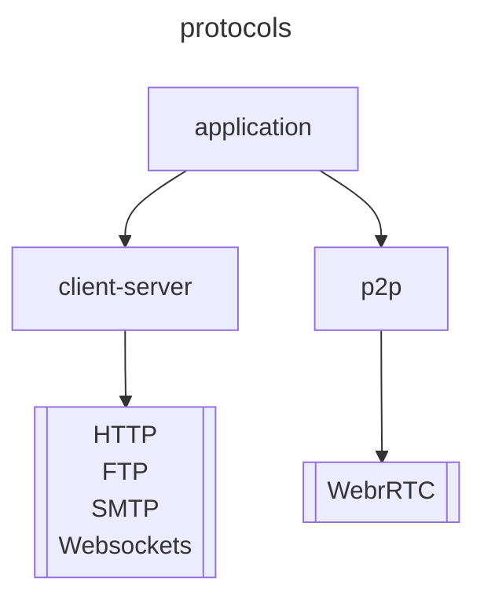
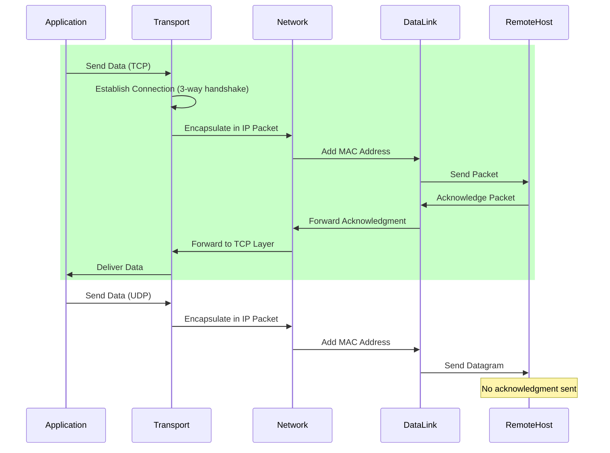

# Communication in a network OSI model

![[System/Assets/us7dk0ib.bmp]]

![[System/Assets/8mpa4iuk.bmp]]

---

## Protocols

```mermaid
---
title: protocols
---
flowchart TD
	
	c[client-server]
	p[p2p]
	a[application]
	p1[[
		HTTP
		FTP
		SMTP
		Websockets
	]]
	p2[[WebrRTC]]

	a --> c & p
	c --> p1
	p --> p2

```

![[System/Assets/4ddtiovw.bmp]]

## TCP/IP and UDP/IC Communication

```mermaid
sequenceDiagram
    participant Application
    participant Transport
    participant Network
    participant DataLink
    participant RemoteHost

    %% TCP Communication
    rect rgb(200, 255, 200)
    Application->>Transport: Send Data (TCP)
    Transport->>Transport: Establish Connection (3-way handshake)
    Transport->>Network: Encapsulate in IP Packet
    Network->>DataLink: Add MAC Address
    DataLink->>RemoteHost: Send Packet
    RemoteHost->>DataLink: Acknowledge Packet
    DataLink->>Network: Forward Acknowledgment
    Network->>Transport: Forward to TCP Layer
    Transport->>Application: Deliver Data
    end

    %% UDP Communication
    Application->>Transport: Send Data (UDP)
    Transport->>Network: Encapsulate in IP Packet
    Network->>DataLink: Add MAC Address
    DataLink->>RemoteHost: Send Datagram
    Note over RemoteHost: No acknowledgment sent
```
