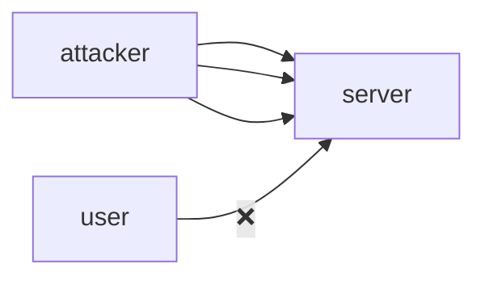

## Problem

```mermaid
flowchart LR
	user
	attacker
	server

	attacker --> server
	attacker --> server
	attacker --> server
	user -->|❌| server
```

---

## Rate limiting algorithms

1. Token Bucket
2. Leaking Bucket
3. Fixed window counter
4. Sliding window log
5. sliding window counter

### Token Bucket
