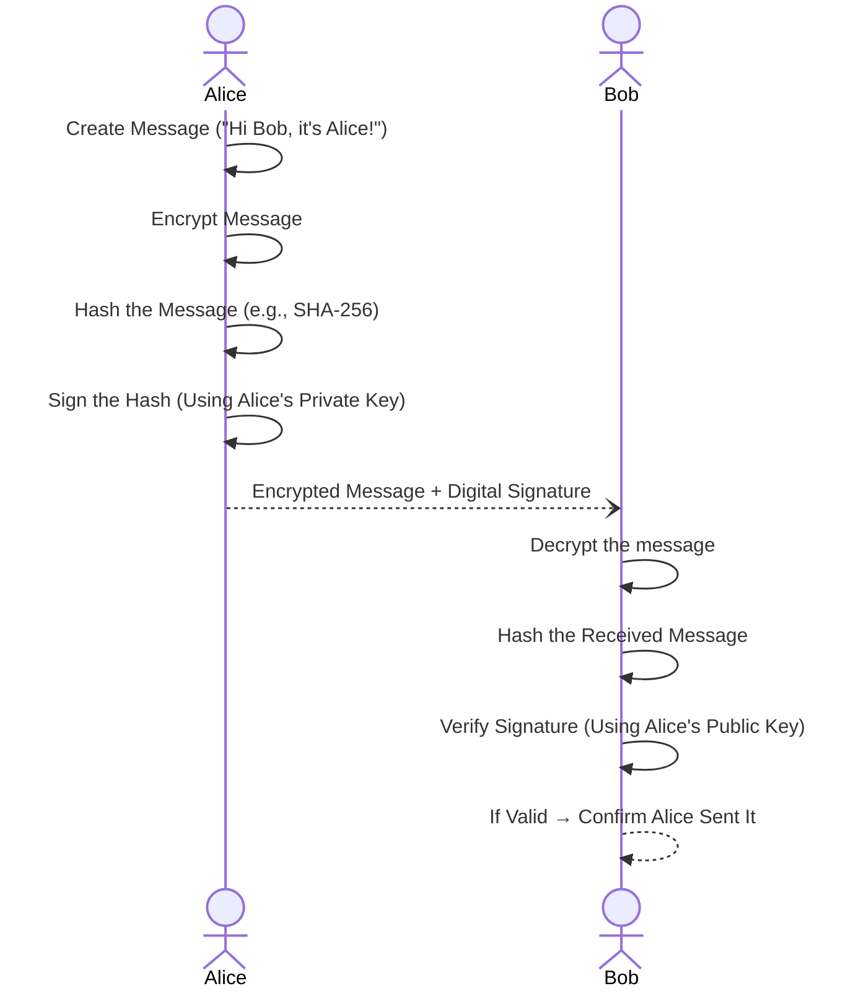

It is used for authentication which utilises assymetric encryption

```mermaid
sequenceDiagram
    actor Alice
    actor Bob

    Alice->>Alice: Create Message ("Hi Bob, it's Alice!")
    Alice->>Alice: Encrypt Message
    Alice->>Alice: Hash the Message (e.g., SHA-256)
    Alice->>Alice: Sign the Hash (Using Alice's Private Key)
    Alice--)Bob: Encrypted Message + Digital Signature
	Bob->>Bob: Decrypt the message
    Bob->>Bob: Hash the Received Message
    Bob->>Bob: Verify Signature (Using Alice's Public Key)
    Bob-->>Bob: If Valid → Confirm Alice Sent It
```

---

# Connected Ideas

[[Digital Signature VS Assymetric Encryption]]
