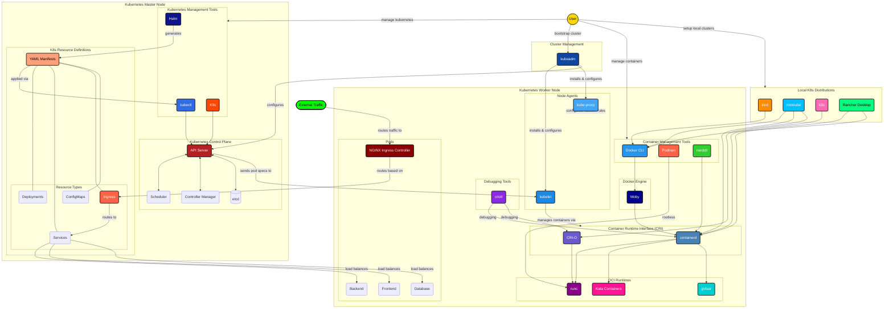

# Comparison Table

![[System/Assets/WhatsApp Image 2025-01-12 at 16.11.05_5ed0bd5c.jpg]]

![[System/Assets/WhatsApp Image 2025-01-12 at 18.15.07_ad13198f.jpg]]

```mermaid
flowchart TD
    %% User Interaction Layer
    User((User)):::user
    ExternalTraffic([External Traffic]):::traffic

    %% Master Node Components
    subgraph MasterNode["Kubernetes Master Node"]
        subgraph K8sTools["Kubernetes Management Tools"]
            Kubectl(kubectl):::kubectl
            Helm(Helm):::helm
            K9s(K9s):::k9s
        end

        subgraph K8sControl["Kubernetes Control Plane"]
            KubernetesAPI(API Server):::k8sAPI
            Scheduler(Scheduler)
            ControllerManager(Controller Manager)
            Etcd[(etcd)]
        end

        subgraph K8sResources["K8s Resource Definitions"]
            Manifests(YAML Manifests):::manifests

            subgraph ResourceTypes["Resource Types"]
                Deployment(Deployments)
                Service(Services)
                Ingress(Ingress):::ingress
                ConfigMap(ConfigMaps)
            end
        end
    end

    %% Worker Node Components
    subgraph WorkerNode["Kubernetes Worker Node"]
        %% Node Components
        subgraph NodeAgents["Node Agents"]
            Kubelet(kubelet):::kubelet
            KubeProxy(kube-proxy):::kubeproxy
        end

        subgraph ContainerTools["Container Management Tools"]
            Docker(Docker CLI):::docker
            Podman(Podman):::podman
            Nerdctl(nerdctl):::nerdctl
        end

        subgraph DebugTools["Debugging Tools"]
            Crictl(crictl):::crictl
        end

        subgraph CRI["Container Runtime Interface (CRI)"]
            containerd(containerd):::containerd
            CRIO(CRI-O):::crio
        end

        subgraph DockerEngine["Docker Engine"]
            Moby(Moby):::moby
        end

        subgraph OCIRuntimes["OCI Runtimes"]
            Runc(runc):::runc
            Kata(Kata Containers):::kata
            gVisor(gVisor):::gvisor
        end

        %% Pods
        subgraph Pods
            NGINXIngress(NGINX Ingress Controller):::ingressController
            Backend(Backend):::pod
            Frontend(Frontend):::pod
            Database(Database):::pod
        end
    end

    %% Cluster Management Tools
    subgraph ClusterManagement["Cluster Management"]
        Kubeadm(kubeadm):::kubeadm
    end

    %% Local Development Cluster
    subgraph LocalK8s["Local K8s Distributions"]
        Kind(kind):::kind
        Minikube(minikube):::minikube
        K3s(k3s):::k3s
        RancherDesktop(Rancher Desktop):::rancher
    end

    %% User Connections
    User -->|manage kubernetes| K8sTools
    User -->|manage containers| ContainerTools
    User -->|setup local clusters| LocalK8s
    User -->|bootstrap cluster| Kubeadm

    %% Tool Connections
    Helm -->|generates| Manifests
    Manifests -->|applied via| Kubectl

    %% Resource Types Connections
    Manifests --- Deployment & Service & Ingress & ConfigMap

    %% CLI-to-Runtime Communication
    Docker --> Moby --> containerd
    Nerdctl --> containerd
    Podman -->|rootless| Runc

    %% K8s Tools Connection
    Kubectl --> KubernetesAPI
    K9s --> KubernetesAPI

    %% K8s Control Plane Components
    KubernetesAPI <--> Scheduler
    KubernetesAPI <--> ControllerManager
    KubernetesAPI <--> Etcd

    %% Worker Node Agents Connections
    KubernetesAPI -->|sends pod specs to| Kubelet
    Kubelet -->|manages containers via| CRI
    KubeProxy -->|configures network rules| WorkerNode

    %% Cluster Management Connections
    Kubeadm -->|installs & configures| Kubelet
    Kubeadm -->|installs & configures| KubeProxy
    Kubeadm -->|configures| KubernetesAPI

    %% Local K8s Setup Tools
    Kind --> Docker
    Minikube --> Docker
    Minikube --> containerd
    Minikube --> CRIO
    K3s --> containerd
    RancherDesktop --> containerd
    RancherDesktop --> Docker

    %% CRI to OCI Runtimes
    containerd --> Runc
    containerd --> Kata
    containerd --> gVisor
    CRIO --> Runc

    %% Debug Tools
    Crictl -->|debugging| containerd
    Crictl -->|debugging| CRIO

    %% Traffic Flow
    ExternalTraffic -->|routes traffic to| NGINXIngress
    NGINXIngress -->|routes based on| Ingress
    Ingress -->|routes to| Service
    Service -->|load balances| Backend & Frontend & Database

    %% Styling
    classDef user fill:#FFD700,stroke:#000,stroke-width:2px,color:#000
    classDef docker fill:#2496ED,stroke:#000,stroke-width:2px,color:#FFF
    classDef podman fill:#FF6347,stroke:#000,stroke-width:2px,color:#FFF
    classDef nerdctl fill:#32CD32,stroke:#000,stroke-width:2px,color:#FFF
    classDef k9s fill:#FF4500,stroke:#000,stroke-width:2px,color:#FFF
    classDef crictl fill:#8A2BE2,stroke:#000,stroke-width:2px,color:#FFF
    classDef kubectl fill:#326CE5,stroke:#000,stroke-width:2px,color:#FFF
    classDef helm fill:#0F1689,stroke:#000,stroke-width:2px,color:#FFF
    classDef kubelet fill:#1E88E5,stroke:#000,stroke-width:2px,color:#FFF
    classDef kubeproxy fill:#42A5F5,stroke:#000,stroke-width:2px,color:#FFF
    classDef kubeadm fill:#0D47A1,stroke:#000,stroke-width:2px,color:#FFF
    classDef kind fill:#FF8C00,stroke:#000,stroke-width:2px,color:#FFF
    classDef minikube fill:#00BFFF,stroke:#000,stroke-width:2px,color:#FFF
    classDef k3s fill:#FF69B4,stroke:#000,stroke-width:2px,color:#FFF
    classDef rancher fill:#00FF7F,stroke:#000,stroke-width:2px,color:#000
    classDef containerd fill:#4682B4,stroke:#000,stroke-width:2px,color:#FFF
    classDef crio fill:#6A5ACD,stroke:#000,stroke-width:2px,color:#FFF
    classDef runc fill:#8B008B,stroke:#000,stroke-width:2px,color:#FFF
    classDef kata fill:#FF1493,stroke:#000,stroke-width:2px,color:#FFF
    classDef gvisor fill:#00CED1,stroke:#000,stroke-width:2px,color:#FFF
    classDef moby fill:#00008B,stroke:#000,stroke-width:2px,color:#FFF
    classDef k8sAPI fill:#B22222,stroke:#000,stroke-width:2px,color:#FFF
    classDef manifests fill:#FFA07A,stroke:#000,stroke-width:2px,color:#000
    classDef ingress fill:#FF6347,stroke:#000,stroke-width:2px,color:#FFF
    classDef ingressController fill:#8B0000,stroke:#000,stroke-width:2px,color:#FFF
    classDef traffic fill:#00FF00,stroke:#000,stroke-width:2px,color:#000
```
